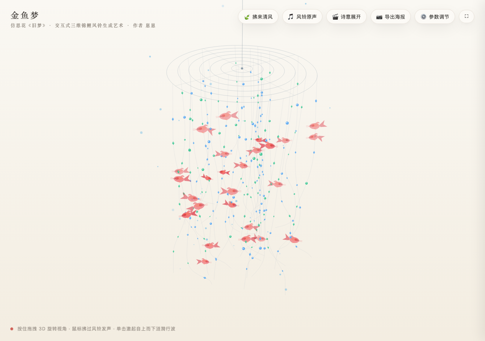
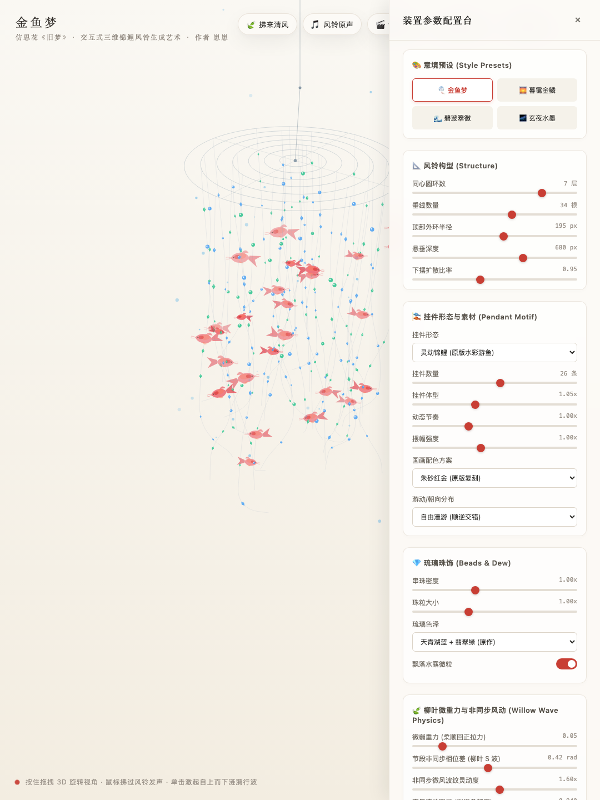
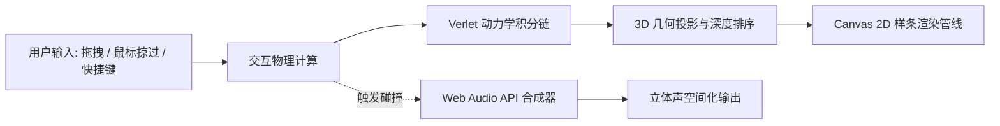

# 《金鱼梦》· 3D 锦鲤风铃交互艺术装置

> 🔗 GitHub 仓库：[JimmyBeck/wind-chimes](https://github.com/JimmyBeck/wind-chimes)  
> 基于原生 HTML5 Canvas 与 Verlet 质点动力学实现的轻量级仿生交互艺术装置（致敬思花《旧梦》），作者：崽崽。



---

## 核心设计与第一性原理

在自然界中，悬挂式风铃与柳叶的飘动并非二维刚体旋转，而是具备以下物理特征：
1. **超低微重力与高空气阻尼**：丝线轻细，重力恢复力微弱，受气流扰动后呈柔顺垂落与缓慢回正。
2. **非同步行波传播**：风力作用于悬挂链顶端，扰动沿质点链逐节向下传递，存在空间深度与时间相位的延迟，形成波动滞后（柳叶拂水）。
3. **空间透视与半透明遮挡**：风铃主体呈 3D 锥柱形排列，前后遮挡顺序随自转动态改变。
4. **非谐波声学共振**：玉石与金属管相撞发声包含非整数倍分音，具有快速衰减与空间立体声特征。

本项目摒弃沉重 3D 引擎与打包工具，采用纯原生 JavaScript（Zero-Build）在 2D Canvas 上实现完整的 3D 投影几何、多质点 Verlet 物理积分与 Web Audio 程序化声音合成。



---

## 技术架构与核心算法



### 1. 空间坐标系统与弱透视投影

风铃质点分布在三维圆柱空间 $(X, Y, Z)$ 中，原点位于顶部中心。

1. **同心环拓扑**：
   顶部由 $N$ 圈同心圆环组成，第 $i$ 环半径为：
   $$R_i = R_{max} \cdot \frac{i}{N}$$
   垂线依黄金角或等角均布挂接于圆环周长上，底部按比例 $k_{spread}$ 扩散或收拢。

2. **空间旋转变换（自转与俯仰）**：
   绕垂直轴（自转角 $\theta_y$）与水平轴（俯仰角 $\theta_x$）进行欧拉旋转：
   $$X' = X \cos\theta_y - Z \sin\theta_y$$
   $$Z_1 = X \sin\theta_y + Z \cos\theta_y$$
   $$Y' = Y \cos\theta_x - Z_1 \sin\theta_x$$
   $$Z' = Y \sin\theta_x + Z_1 \cos\theta_x$$

3. **透视缩放与视口映射**：
   设相机视距为 $D_{cam}$，透视投影缩放因子 $s$ 为：
   $$s = \frac{D_{cam}}{D_{cam} + Z'}$$
   屏幕平面映射坐标为：
   $$x_{screen} = c_x + X' \cdot s, \quad y_{screen} = c_y + Y' \cdot s$$

4. **画家算法（Depth Sorting）**：
   每帧对所有空间图元（圆环、垂线质点、琉璃珠饰、锦鲤实体）按视距 $Z'$ 进行升序排序，由远及近依次绘制，保证透明水彩与层叠关系的正确性。

---

### 2. 物理动力学引擎

每根垂线细分为 $M$ 个质点串联而成的软绳系统。

#### (1) Verlet 数值积分
相较于显式欧拉法，Verlet 积分无需显式维护速度向量，数值稳定性高，天然适合轻量级绳索模拟：
$$x_{t+\Delta t} = x_t + (x_t - x_{t-\Delta t}) \cdot (1 - \gamma) + a \cdot \Delta t^2$$
其中：
- $\gamma \in [0.86, 0.96]$：流体介质阻尼比。
- $a = g + F_{wind} + F_{mouse}$：合加速度向量。

#### (2) 距离约束松弛（Relaxation）
为保持丝线不可伸长性，每帧对相邻两质点 $p_k, p_{k+1}$ 执行一次距离修正，设自然静止间距为 $L_0$：
$$\Delta d = \|p_{k+1} - p_k\| - L_0$$
$$p_{k+1} \leftarrow p_{k+1} - \frac{1}{2} \Delta d \cdot \frac{p_{k+1} - p_k}{\|p_{k+1} - p_k\|}$$
$$p_k \leftarrow p_k + \frac{1}{2} \Delta d \cdot \frac{p_{k+1} - p_k}{\|p_{k+1} - p_k\|}$$
首节点固定于顶环悬挂点（$p_0 = \text{Anchor}$）。

#### (3) 行波式微风场传播（柳叶非同步摇曳）
为消除所有垂线整体同步晃动的“铁丝栅栏感”，空间扰动引入时间与节点深度延迟：
$$F_k(t) = A_{wind} \cdot \sin\left(\omega t - k \cdot \delta_{phase} + \phi_m\right) \cdot e^{-\alpha k}$$
- $k$：质点在丝线上的节点序号（$0 \le k < M$）。
- $\delta_{phase}$：沿线向下传播的逐节相位滞后量（默认 $0.42\text{ rad}$）。
- $\phi_m$：不同垂线在空间周向上的相位偏移。
该波形自顶环流向悬垂末梢，形成轻盈、流动的柔顺波浪。

#### (4) 双曲正切软限幅（Soft Limiter）
为杜绝鼠标强冲量或高频扰动下的质点速度发散与奇点塌缩，推力施加双曲正切软约束：
$$F_{clamped} = F_{max} \cdot \tanh\left(\frac{F}{F_{max}}\right)$$
确保能量输入永远在可控数值边界内。

---

### 3. 仿生多节脊椎骨骼与流体力学

锦鲤挂件挂载于指定垂线节点上，形态依据游动动力学实时解算：
1. **流体航向（Yaw）与俯仰（Pitch）**：鱼头朝向由所在线段切线向量与摆尾行波方向加权合成。
2. **脊椎链游动方程**：
   10 节脊椎关节的偏角满足行波公式：
   $$\theta_i(t) = A(i) \cdot \sin\left(\omega_{swim} \cdot t - i \cdot k_{spine}\right)$$
   摆动振幅 $A(i)$ 沿头部到尾梢线性放大（$0.08 \to 0.50$），呈现前身稳定、尾部灵动甩动的姿态。
3. **透视轻纱凤尾**：尾鳍末梢采用三次贝塞尔平滑曲线向后拖曳，边缘辅以天青色水墨晕染渐变。

---

### 4. 程序化声景合成体系

无需外部音频依赖，基于 Web Audio API 实现程序化合成：
1. **五声音阶调式**：映射中国传统五音（宫、商、角、徵、羽，跨 C6 ~ A7 频段）。
2. **非谐波共振模型**：模拟管状金属与琉璃撞击的非整数倍分音比：
   $$\text{Partials} = [1.000, 2.756, 5.404, 8.933]$$
3. **动态包络衰减**：瞬态起音（$5\text{ms}$）与双阶段指数衰减（释放时间 $1.2\text{s} \sim 2.6\text{s}$）。
4. **空间立体声定向**：利用 `StereoPannerNode` 根据发声点在屏幕的横坐标动态分配左右声道声相（$-1.0 \sim +1.0$）。

---

## 系统参数字典 (Single Source of Truth)

所有控制参数统一在 [`sketch.js`](sketch.js) 顶部的 `CONFIG` 中集中声明。交互抽屉与渲染循环均严格读取该单源字典：

| 模块 | 参数标识 (`key`) | 默认值 | 物理/视觉含义及调节影响 |
| :--- | :--- | :--- | :--- |
| **风铃构型** | `numRings` | `7` | 同心圆环层数 (3 ~ 8)。影响顶部涟漪复杂度 |
| | `numStrands` | `34` | 垂线总数 (12 ~ 48)。控制帘幕疏密度 |
| | `topRadius` | `195` | 顶部外环外径 (px)。控制整体开阔度 |
| | `dropLength` | `680` | 垂线悬挂总长度 (px) |
| | `spreadRatio` | `0.95` | 底部收拢/展开比。$<1.0$ 呈微收钟形，$>1.0$ 呈外展伞形 |
| | `ringPitch` | `0.38` | 俯视透视仰角。值越大俯视感越强 |
| **仿生挂件** | `pendantType` | `"koi"` | 挂件形态：`koi`（锦鲤）、`butterfly`（彩蝶）、`ginkgo`（银杏叶）、`crane`（千纸鹤）、`custom`（自定义图元） |
| | `koiCount` | `26` | 空间中悬游挂件总数 (4 ~ 45) |
| | `koiScale` | `1.05` | 尺寸缩放比例 (0.6 ~ 1.8) |
| | `koiSpeed` | `1.00` | 摆尾/扇翅节奏频率 |
| | `koiWiggleAmp` | `1.00` | 脊椎波浪柔韧摆幅 |
| | `koiColorTheme` | `"cinnabar"` | 配色：`cinnabar` (朱砂)、`golden` (赤金)、`cyan` (翠微)、`monochrome` (水墨)、`iridescent` (幻锦) |
| | `koiFacingMode` | `"auto"` | 朝向策略：`auto` (交错环游)、`cw` (顺时针)、`ccw` (逆时针) |
| **珠饰晶石** | `beadDensity` | `1.00` | 垂线上串珠分布密度 |
| | `beadSize` | `1.00` | 晶石基础粒径缩放 |
| | `beadTheme` | `"blueGreen"`| 晶石色系：天青翡翠、琥珀流金、紫玉荧晶、冰雪清透 |
| | `dewParticles` | `true` | 空间中缓缓下沉的甘露水滴微粒 |
| **物理引擎** | `gravity` | `0.055` | 垂向微重力回复系数。值极低时保持轻盈垂顺 |
| | `segPhaseLag` | `0.42` | 逐节非同步行波相位差 (rad)。控制柳叶波浪的滞后感 |
| | `windFlutter` | `1.00` | 微风非同步波动灵敏度 |
| | `waveTension` | `0.28` | 质点间张力传导系数 |
| | `airDrag` | `0.920` | 流体阻尼 (0.86 ~ 0.96)。值越高摆动消退越柔和 |
| | `windStrength` | `1.00` | 背景自然穿堂风基准强度 |
| | `mouseForce` | `1.20` | 光标掠过时的空气推力大小 |
| | `autoRotateSpeed`| `0.0028`| 整体装置慢速自转角速度 (rad/frame) |
| | `strandWidth` | `0.45` | 悬垂丝线物理线宽 (px) |
| **背景** | `bgTheme` | `"ricePaper"`| 底纸色调：澄心堂宣白、温润素绢、潇湘竹青、玄夜玄墨 |

| **声音系统** | `chimeAudioEnabled` | `true` | 触碰碰撞程序化合成发声开关 |
| | `bgAudioEnabled` | `false` | 真实环境风铃音轨开关 |
| | `volume` | `0.75` | 主输出增益 |

---

## 快速开始 (Zero-Build)

本项目无编译构建依赖，不使用 Node.js 构建工具链。

### 1. 本地直接运行
直接使用现代浏览器（Google Chrome / Safari / Edge / Firefox）打开 `index.html`：
```bash
# macOS
open index.html

# Linux
xdg-open index.html

# Windows
start index.html
```

### 2. 静态服务器运行（推荐）
若需要支持完整的 Web Audio 音频上下文策略与自定义图片导入，可启动单行静态服务器：
```bash
# Python 3
python3 -m http.server 8000

# 浏览器访问 http://localhost:8000
```

### 3. 单文件独立传阅 (Standalone)
若需将项目打包为单独一个文件发送给他人（如通过微信、邮件直接发单文件传阅），可直接发送根目录下的 [`standalone.html`](standalone.html)：
- 内联了全部 CSS 样式、Verlet 物理算法与 Canvas 渲染管线。
- 零外部文件与网络依赖，接收方双击即可离线全屏运行、使用参数控制台并由 Web Audio 实时合成风铃清脆声景。

---

## 交互指南与快捷键

| 操作 | 行为说明 |
| :--- | :--- |
| **鼠标拖拽 / 触控滑动** | 360° 旋转三维空间视角，观察不同角度的遮挡层次 |
| **光标轻拂丝线** | 产生空气扰动冲量，激起自上而下的局部行波，触发碰撞清音 |
| **快捷键 `H`** | 展开 / 收起侧边参数配置抽屉 |
| **快捷键 `Space`（空格）** | 拂来一阵清风，激起整片风铃的下行行波涟漪 |
| **快捷键 `Esc`** | 关闭配置抽屉 |
| **按钮：诗意展开** | 重放从虚无中水纹涟漪生长的开场序列 |
| **按钮：导出海报** | 导出当前帧 $2\times$ 高清艺术 PNG 海报 |
| **按钮：风铃原声** | 开启/暂停自然夏日风铃环境音轨 |

---

## 目录结构

```text
.
├── index.html            # 主入口：极简 DOM，负责加载样式、Canvas 容器与模块脚本
├── standalone.html       # 单文件独立版：全内联样式与算法，适合单文件零依赖传阅
├── style.css             # 视觉规范：背景、毛玻璃抽屉、控制面板与响应式排版
├── sketch.js             # 主控制流与参数中心：集中声明全局 CONFIG，负责主循环与事件派发
├── koi.js                # 物理/视觉实体模块：质点 Verlet 积分、形态解算与水彩样条绘制
├── sound.js              # 声景模块：Web Audio API 程序化合成与物理撞击触发
├── cover.jpg             # 项目封面海报
├── preview.png           # 核心运行预览图（用于 README 及外部展示）
├── demo_preview_drawer.png # 控制面板/交互抽屉展示图
├── video.mp4             # 项目动态展示视频 (MP4)
├── wind_chime.m4a        # 音效素材 (AAC)
├── wind_chime.wav        # 高保真音效素材 (WAV)
├── .gitignore            # Git 忽略配置
└── README.md             # 硬核技术拆解与项目说明文档
```

---

## 许可证与致敬说明

- 视觉原型致敬：思花老师作品《旧梦》。
- 代码开源协议：MIT License。
